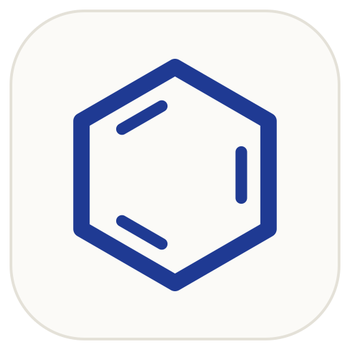
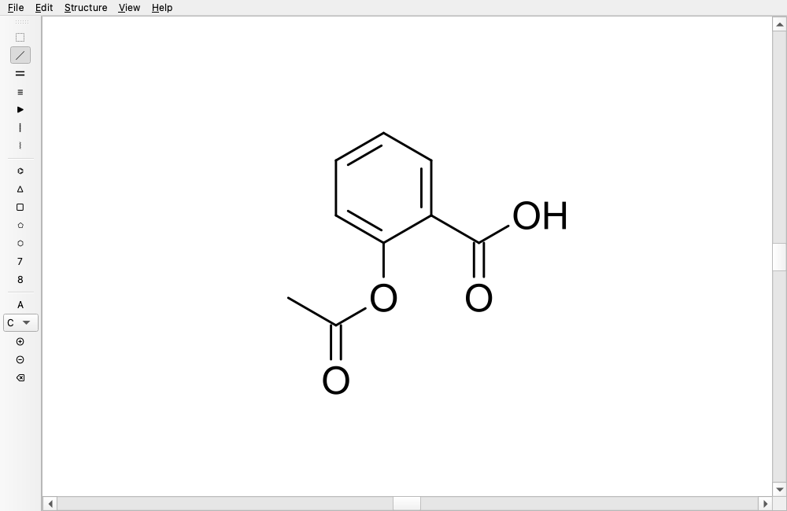

<p align="center"></p>

<h1 align="center">Paper &amp; Penzene</h1>

An open-source, native desktop chemical structure editor — a free alternative to ChemDraw.
Runs on macOS, Linux and Windows. Built with C++20, Qt 6 and [RDKit](https://www.rdkit.org).

> Status: early development. See the [roadmap](https://github.com/users/JamesOBrien2/projects) and
> [issues](https://github.com/JamesOBrien2/paper-and-penzene/issues).

<p align="center"></p>

## Features (v0.1)

- Draw atoms, bonds (single/double/triple, wedge/hash), chains and rings with the mouse
- **ChemDraw-style hotkeys**: point at an atom or bond and type. `1111` draws a chain,
  `2` sprouts a carbonyl, `a` a phenyl, `O` an OMe. The arrow keys walk the molecule
  (Help → Keyboard Shortcuts)
- Open/save `.penz`, MOL and SDF; paste or import SMILES; Clean structure (RDKit)
- Export SVG, PNG and PDF; copy as image + MOL + SMILES
- ACS 1996 drawing style, implicit hydrogens and valence warnings

## Build

Requires [pixi](https://pixi.sh). It fetches Qt, RDKit and the toolchain from conda-forge.

```sh
pixi run build   # build/bin/penzene
pixi run test
pixi run run     # launch the app
pixi run install-app   # macOS: self-contained app in ~/Applications
```

## Roadmap

| Milestone | Highlights |
|---|---|
| v0.1 | Draw atoms/bonds/rings, undo, MOL/SDF + `.penz`, SMILES paste, Clean, SVG/PNG/PDF export, clipboard |
| v0.2 | Dark/light mode, Catppuccin themes, ring fill, text, arrows, formula/MW, InChI, CDXML import |
| Later | Structure → name, name → structure, style presets, templates, printing |

## Acknowledgements

UX and tool set inspired by [Ketcher](https://github.com/epam/ketcher) (Apache-2.0).
Chemistry by RDKit (BSD-3). GUI by Qt (LGPL-3.0).

## License

GPL-3.0-or-later. See [LICENSE](LICENSE).
